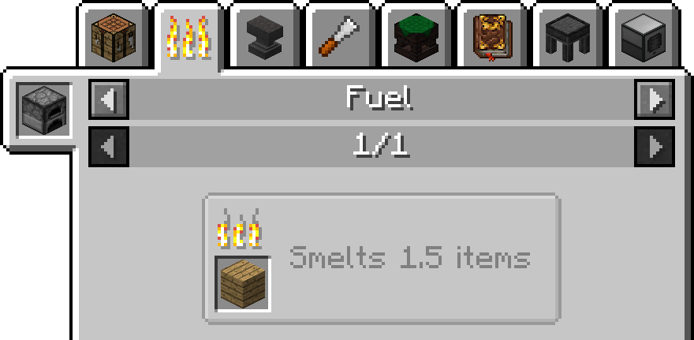
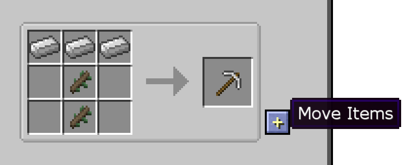
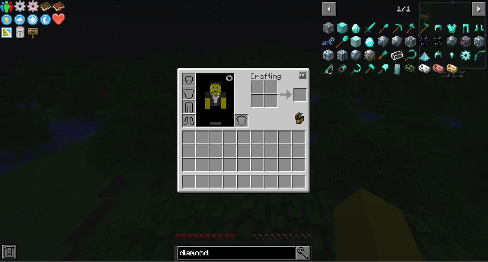
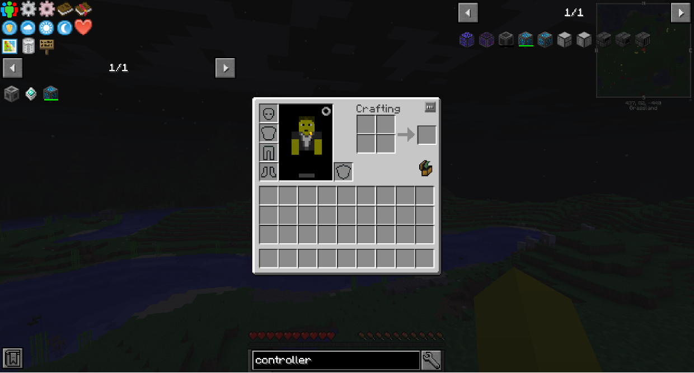

#Just Enough Items

On the right, you can find every block and item in the modpack. You can toggle JEI with CTRL + O.

By default, you can click any item, or hover over the item and then hit R, and you will see the crafting recipe for that item.

On the left of this menu, you can see everything that you can craft that recipe in. At the top, you can see all the different methods it can be crafted.

When you're hovering over an item in JEI, you can see what mod it's from under the name of the item.

You can hover over an item and then hit U, to see all the uses for that item.

You can press the + button the the right of recipes to automatically move those items to their respective slots in the crafting table.

The text box at the bottom is the search bar. Type things in it to filter the item list. You can type @ followed by the mod name to filter to only items from that mod.

You can hover over items and hit A to save them to your bookmarked items, which will appear to the left of the inventory and stay there until you hit A on them again. You can temporarily hide the bookmarks by clicking the button at the bottom left corner.

